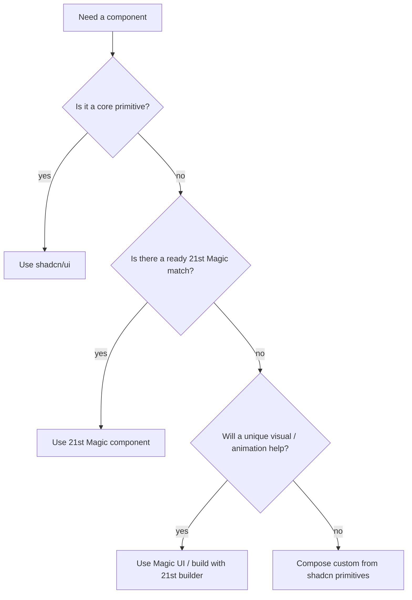

# UI Component & Design Strategy

A single reference for choosing, implementing, and swapping front‑end components in **Next.js + Tailwind + Supabase** using **shadcn/ui**, **21st Magic**, and **Magic UI**.

---

## 1 · Design Foundations

| Area                 | Current Setup                                                                                          | Why It Works                                                   | TODO / Notes                                                                         |
| -------------------- | ------------------------------------------------------------------------------------------------------ | -------------------------------------------------------------- | ------------------------------------------------------------------------------------ |
| **Typography**       | Geist Sans + Geist Mono loaded in **globals.css** (CSS vars)                                           | Modern, legible; easy utility usage (`font-sans`, `font-mono`) | Define heading scale (`text-2xl`, `font-bold` etc.) in *PageHeader* component        |
| **Color & Theme**    | Light/dark palettes via CSS vars; shadcn init will add semantic vars (`--primary`, `--destructive`, …) | Centralized theming; dark‑mode ready                           | Decide base Tailwind palette (e.g. Zinc). Brand overrides can live in `globals.css`. |
| **Spacing & Layout** | Tailwind spacing scale; `container mx-auto`; Flex/Grid utilities                                       | Consistency; responsive out of box                             | Establish section spacing helpers (e.g. `Section` component).                        |
| **Visual Hierarchy** | Achieved via headings, semantic colors, spacing                                                        | Guides user focus                                              | Enforce in high‑level components (`PageHeader`, card variants).                      |
| **Iconography**      | `lucide-react` (shadcn default)                                                                        | Cohesive, open source                                          | Install with `pnpm add lucide-react`.                                                |
| **Accessibility**    | shadcn components are a11y‑minded                                                                      | Keyboard, ARIA support                                         | Use contrast checker; test keyboard nav.                                             |

---

## 2 · Component Catalog & Default Implementations

All catalog slots start with the **shadcn/ui** version (🛡 Safe). Each can be swapped to a 🚀 Wow implementation via `uiConfig.ts` aliasing.

| Zone                   | Interface Contract (key props) | 🛡 Default (shadcn)           | 🚀 Upgrades                                         |
| ---------------------- | ------------------------------ | ----------------------------- | --------------------------------------------------- |
| **App Shell**          | `children`                     | Custom `SafeAppShell` wrapper | Parallax / RetroGrid background (Magic UI)          |
| **Nav Bar (desktop)**  | `items: NavItem[]`             | `NavigationMenu`              | Custom motion top‑bar, Bento Grid header (Magic UI) |
| **Mobile Drawer**      | `open`, `onOpenChange`         | `Sheet`                       | Glass‑blur slide‑in with framer‑motion              |
| **Command Palette**    | `open`, `onSelect`             | `CommandDialog`               | AI‑chat search (21st Magic → *AI Chat*)             |
| **Theme Toggle**       | `checked`, `onChange`          | `Switch`                      | Shimmer/Rainbow toggle (Magic UI Button)            |
| **User Menu**          | `session`, `onSignOut`         | `Avatar` + `DropdownMenu`     | Avatar Circles w/ presence (Magic UI)               |
| **Info Card**          | `title`, `actions`, `children` | `Card`                        | Tilt / Warp‑background (Magic UI)                   |
| **Status Badge / Tag** | `variant`, `label`             | `Badge`                       | GradientChip (Magic UI)                             |
| **Data Table**         | `data[]`, `columns`            | `Table`                       | TanStack table w/ row pinning (21st Magic Tables)   |
| **Timeline**           | `events[]`                     | `ScrollArea` + virtual list   | Animated List (Magic UI)                            |
| **Modal / Dialog**     | `open`, `onClose`              | `Dialog`                      | Hero‑Video Dialog (Magic UI)                        |
| **Toast / Notify**     | via provider                   | `Sonner`                      | Multi‑channel Notification Center (21st Magic)      |
| **Progress**           | `value`                        | `Progress` (linear)           | Circular / Scroll Progress (Magic UI)               |

> **Tip:** Interface contracts live in `*.types.ts` next to each component. Keep them stable to enable painless swapping.

---

## 3 · Library Decision Flow



---

## 4 · Swapping Mechanism

* `uiConfig.ts` exports an object whose values are either direct imports (🛡) or `React.lazy` wrappers (🚀).
* Toggle via `NEXT_PUBLIC_UI_WOW` env var **or** feature flag service.
* Wrap any lazy slot in `<Suspense fallback>` where used (AppShell already does this).

```ts
export const ui = {
  NavBar: IS_WOW ? lazy(() => import("@/components/custom/WowNav")) : NavigationMenu,
  // … repeat for other zones
}
```

---

## 5 · Implementation Checklist

1. **Run shadcn scaffold**

   ```bash
   npx shadcn-ui@latest init
   npx shadcn-ui@latest add navigation-menu sheet command switch avatar dropdown-menu card badge table dialog scroll-area sonner
   ```
2. Add each default to `uiConfig.ts` and create prop interfaces.
3. Build **Safe** pages; commit baseline branch `feat/shadcn-baseline`.
4. Prototype 1‑2 🚀 upgrades (e.g., Wow NavBar) to validate lazy swap & theming.
5. Maintain "Wow backlog" for future sprints.

---

## 6 · MCP Tool References

| Server                          | Key Endpoints                                                                                    | Typical Use                                                                             |
| ------------------------------- | ------------------------------------------------------------------------------------------------ | --------------------------------------------------------------------------------------- |
| `shadcn-ui-server`              | `list_shadcn_components`, `get_component_details`, `get_component_examples`, `search_components` | Fetch boilerplate & examples for shadcn primitives                                      |
| `@magicuidesign/mcp`            | `getUIComponents`, `getSpecialEffects`, `getButtons`, …                                          | Pull high‑impact Magic UI components (Marquee, Bento Grid, etc.)                        |
| `github.com/21st-dev/magic-mcp` | `21st_magic_component_builder`                                                                   | AI‑generate bespoke components or fetch 21st Magic catalog (File Tree, Sign In, Tables) |

---

### End of Document

Use this doc as the single source of truth while you wire up the baseline UI and plan iterative "Wow" upgrades.
